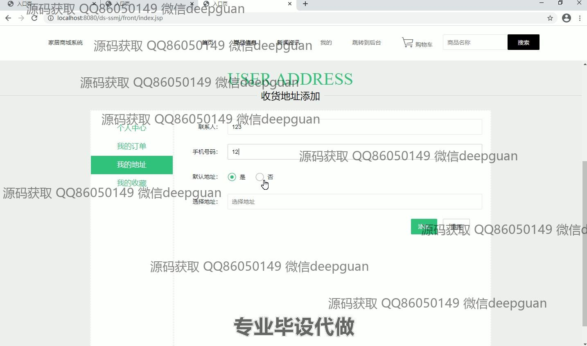

<h1 align="center">基于JavaWeb的家居商城系统的设计与实现</h1>

## 简介
基于家居商城系统：角色分为管理员、用户；实现用户管理、商品管理、订单管理和收货地址管理功能，支持用户注册、购物车、密码修改等操作，提升用户购物体验与管理效率。    --计算机毕业设计源码；毕设源码；java毕业设计源码

## 联系方式

<h3 align="center">获取完整代码与数据库文件 + 微信：deepguan QQ: 86050149 QQ群: 783742310</h3>

<h3 align="center">可帮忙远程部署 包运行成功！提供远程部署、修改代码、设计文档指导、代码讲解等服务！</h3>

## 功能介绍（完整见运行截图）
管理员：管理用户信息，包括查看、添加、修改和删除用户；管理商品分类、商品信息，支持商品的添加、修改、查看和删除；管理订单信息，查看订单详情，按条件查询和批量操作订单；管理商品展示模块，包括轮播图和商品信息；提供系统登录、注册和身份验证功能，保障系统安全性。   

用户：注册和登录商城，访问主页查看热门商品和促销信息；浏览商品详情，加入购物车并进行结算；管理个人信息，包括修改密码和查看订单历史；管理收货地址和收藏夹，支持添加、修改和删除操作，通过购物车功能查看和调整购买计划，最终完成在线支付和订单管理。

## 运行截图

本代码来源于网络,仅供学习参考使用!

